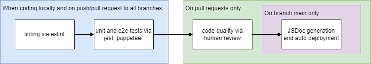

# Pipeline Progress and Functionality

### Overview

1. Pull the latest changes from main
2. Create a local branch
3. Run tests on changes
    i. Run npm install once to install dependencies
    ii. Run npx eslint . to run lint on the entire directory
    iii. Run npm test to run the unit tests
4. Commit changes to the local branch
5. Push the local branch to origin
6. Create a pull request to merge changes into main
7. Review changes (requires 2 approvals)
8. Merge changes

Merging changes into or pushing onto main will run the Deploy static content to GitHub Pages action.
This will host the static contents of the ./source directory (HTML, CSS, and JavaScript) on GitHub Pages, and generate JSDocs.

Merging changes into or pushing onto any branch will run the Unit Test Execution action. This will run the unit tests on the updated branch.

### Functionality
Here is a diagram of our pipeline:

In short, we are able to:
- [x] check codestyle
- [x] confirm code quality with human review
- [x] run unit tests and end to end tests manually and via human execution
- [x] generate docs with JSDocs
- [x] auto deploy with github pages

### Future plans
We plan to start consistently running HTML validation using the w3 validation checker manually. The reason for this is because we were not able to find an auto validation action that suited are needs, and we deemed manual review was good enough for the scope of our project.

We also plan on making sure comprehensive tests are run. Currently we only have comprehensive unit tests, and now that the frontend and backend functionality of our app has been integrated, we will write end to end tests for our app before deploying the full integrated site to pages.